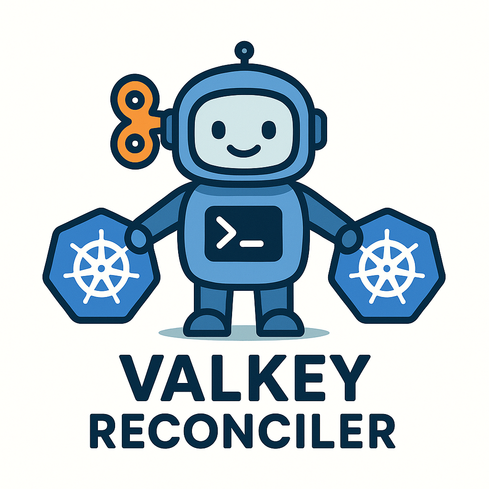

# Valkey Reconciler



- A poor mans Valkey Operator

The reconciler is a small app that checks in with Sentinel and updates a label on the valkey sentinel pod that
is the current master.

Then you can have a simple kubernetes service that uses that lavel to select pods. This abstracts away client applications having
to relate to Redis sentinel connections. 

If the master node dies, the clients will not be able to connect while a leader election is held, but when the election is over, the label is
assigned at once and new connections can start. Depending on the size of the cluster this process can take anywhere from 1 to 30 seconds.

## Components in the setup:

1. Bitami valkey helm chart.

This sets up a Valkey cluster of 3 or more pods where each pod runs valkey as well as valkey sentinel.

2. The "valkey" service

A simple kubernetes service that directs traffic to the selector that has to match the MASTER_POD_LABEL_NAME and MASTER_POD_LABEL_VALUE env vars defined on the reconciler.

```yaml:
apiVersion: v1
kind: Service
metadata:
  name: valkey
spec:
  selector:
    vk-master: "true"
  ports:
  - protocol: TCP
    port: 6379
    targetPort: 6379
  type: ClusterIP

```

3. Valkey reconciler

The reconciler is responsible for listening to sentinel pubsub events and updating the pod labels accordingly. 

## Configuration of the reconciler

| Value | Default |
|--|--|
| VALKEY_SENTINEL_PORT | 26379 |
| VALKEY_SENTINEL_HOST | nil |
| VALKEY_SENTINEL_PASSWORD | nil |
| VALKEY_MASTER_NAME | myprimary |
| POD_NAMESPACE | default |
| MASTER_POD_LABEL_NAME | valkey-master |
| MASTER_POD_LABEL_VALUE | true |


###  Div notes on testing

This setup was tested using k3d setup with a cluster:

```
# setup cluster
k3d cluster create ask-cluster --agents 3
k3d cluster edit ask-cluster --port-add "127.0.0.10:8000:80@loadbalancer"

# install kubernetes dashboard

helm upgrade --install kubernetes-dashboard kubernetes-dashboard/kubernetes-dashboard --create-namespace --namespace kubernetes-dashboard

# forward the dashboard to localhost
kubectl -n kubernetes-dashboard port-forward svc/kubernetes-dashboard-kong-proxy 8443:443

# create token to access dashboard:
kubectl -n kubernetes-dashboard create token admin-user

# setup local valkey sentinel cluster named vk:

helm upgrade -f values.yaml vk oci://registry-1.docker.io/bitnamicharts/valkey

# install test server:
cd test-server
make build deploy

# install reconciler:

cd valkey-reconciler
# deploy app (also adds kubernetes deployment)
make build deploy

# setup RBAC:
kubectl apply -f ./service-account.yaml

# install valkey service:
kubectl apply -f ./valkey-main.yaml

```

By running the test-server/run-checks.bash in a terminal you can see when the redis service gets downtime due to sentinel going down.
